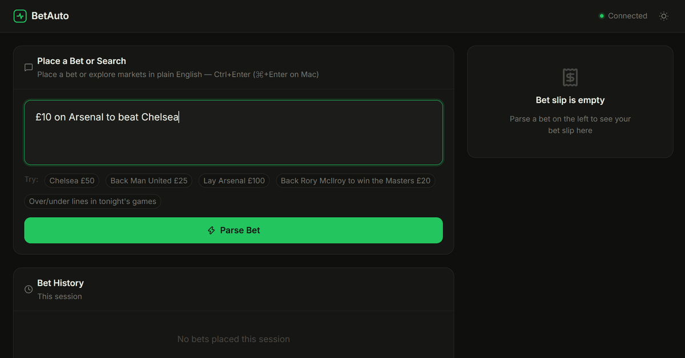
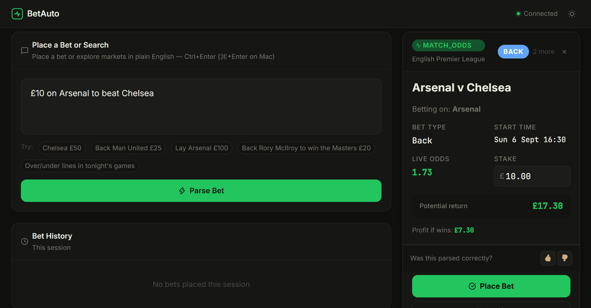
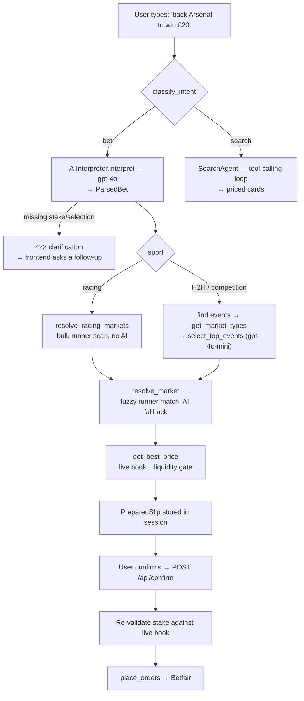

# BetAuto

Natural-language betting on the Betfair Exchange.

[](https://github.com/stephenjjmcmahon/Bet_Automation/actions/workflows/tests.yml)
[](LICENSE)

Type `back Galopin Des Champs each way at Cheltenham, £20`. You get back a slip with
the right race, the right horse and a live price. If there isn't enough money on the
other side to fill £20, it says so instead of guessing. Confirm and the bet goes on
through the Betfair API, for real money.

Parsing the sentence is the easy half. Betfair's search API can't find a horse by
name, and market names differ between competitions, so most of the code here is the
layer that turns a parsed sentence into a market id and a selection id that actually
exist.

There is also a search mode. Ask "what's on at Ascot today?", or just type a name
like "Scottie Scheffler", and an agent walks the exchange and comes back with priced
cards you can bet in one click.





The same screen before and after. "£10 on Arsenal to beat Chelsea" resolves to a real
market and gets priced against the live book. The "2 more" badge is the other two
ranked candidates, and nothing is placed until you confirm.

---

## Tech stack

| Layer | Choice |
|---|---|
| Backend | FastAPI + Uvicorn |
| Parsing | OpenAI `gpt-4o`, structured outputs |
| Ranking and fuzzy matching | OpenAI `gpt-4o-mini` |
| Exchange | Betfair Exchange API (`listEvents`, `listMarketCatalogue`, `listMarketBook`, `placeOrders`) |
| Frontend | One HTML file, vanilla JS, served by the backend at `/` |
| Storage | SQLite for the bet lifecycle, JSONL for model traces |
| Tests | pytest, 206 tests, fully mocked, no network |
| Accuracy | offline eval harness (`python -m backend.eval`) |
| Lint | ruff, enforced in CI |
| Deployment | Docker and compose; CI builds the image and smoke-tests `/health` |

---

## How a bet gets placed



1. **Classify.** Bet instruction, or search query?
2. **Parse.** `gpt-4o` with structured outputs returns a `ParsedBet`: selection,
   sport, side, stake, market type, line, opponent, competition. A missing required
   field gets a follow-up question rather than a guess.
3. **Find events.** Head-to-head sports get a text search. Competition sports (golf,
   racing, motor sport, politics) have no useful head-to-head name to search on, so
   they pull the full event list for the sport.
4. **Pick the event and market.** `gpt-4o-mini` ranks the candidates against the
   market types Betfair actually offers and returns up to three
   `{event_id, market_type}` pairs.
5. **Resolve.** Turn that into a real `marketId` and `selectionId`, matching runner
   names fuzzily, with an AI fallback when substring matching comes back empty.
6. **Price and liquidity.** Fetch the live book, take top of book for the side you
   want, and refuse the slip unless the size available covers the stake.
7. **Confirm.** The stake is re-checked against a fresh book, then `placeOrders` runs
   and the response body gets read properly.

---

## The hard parts

### Betfair can't search for a horse

`listEvents` matches event and competition names, never runner names, and Betfair
models racing as event = meeting, market = race, runner = horse. "Constitution Hill"
is invisible to every search endpoint it exposes.

The resolver pulls every upcoming market of the requested type in one bulk call,
around 450 on a busy day, and scans all the runners for the name. A horse runs at
most once a day, so a clean hit identifies the race with no model involved. Two
tracks with the same greyhound name gives a slip for each; more hits than that and it
asks which meeting you meant.

### The ante-post fallback

A horse entered only for a future race has no win market yet, so "to win the Gold
Cup" finds nothing in the win scan.

Order matters more than it looks here. A festival usually does have win markets for
its other races, so whichever pool gets scanned first biases the answer: win-first
invents a plausible horse from today's card, ante-post-first does the reverse. Both
pools get an exact pass, then one fuzzy pass runs over the two combined, so the model
sees every real candidate at once.

### Cross-wired market and selection ids

Ante-post two-year-olds often hold two or three engagements, the same horse entered
in the Windsor Castle and the Chesham. Ask a model for a market and a selection in
one answer and it will cross-wire them, handing back a market from one race and a
selection from another. The slip looks perfectly fine and puts the money on the wrong
race.

The model's answer is now used for one thing only, recovering the runner's name, and
the pool is re-scanned deterministically for it.

### Tournament outrights

Someone who appears only as a runner inside a competition-level market, England
inside "FIFA World Cup", is invisible to a name search for the same reason a horse
is. The search agent reuses the runner scan over an allowlist of outright market
types, so "Scottie Scheffler" turns up his winner, top-10 and make-cut markets
alongside his fixtures.

### Two models

`gpt-4o` parses, where a long prompt and a guaranteed JSON schema earn their cost.
`gpt-4o-mini` handles ranking and fuzzy name matching: simpler, much higher volume,
and it has the tokens-per-minute headroom for when a broad query drags in a whole
day's racing.

One guard was needed. When the parser emits a market-type code Betfair really does
offer, that code is pinned onto the smaller model's picks, because `gpt-4o-mini` kept
"correcting" rugby's head-to-head market to `MATCH_ODDS`. Its real Betfair code is
the literal string `UNUSED`.

### placeOrders returns 200 for rejected bets

The real status is in the `PlaceExecutionReport` body. Reporting success on the
status code alone tells someone their money is down when it isn't.

---

## Evals

```bash
python -m backend.eval match
python -m backend.eval parses
```

Both offline and deterministic, with no network calls.

`match` runs every strategy in `eval/matchers.py` over a 21-case corpus, 17 of them
real inputs from the logs. It scores fixes and regressions against a baseline rather
than reporting a bare pass rate, and the baseline is a frozen copy of the matcher I
replaced, so a revert fails the build.

| matcher | passed | fixes | regressions |
|---|---|---|---|
| `legacy_loose` (baseline) | 15/21 | | |
| `exact_first` | 18/21 | 3 | 0 |
| `current` (shipped) | 21/21 | 6 | 0 |

The runner lists in the corpus are reconstructions, so this is a regression metric
rather than a field accuracy figure. Some cases expect "no confident match", since an
ambiguous request belongs with the AI fallback.

`parses` reads `logs/interpreter.jsonl` (582 entries, 553 successful parses at the
last run) and asks the app's own mapping what each label resolves to, so it can't
disagree with the code it audits. Three of the 553 hit a gap the matcher can't fix.

It caught a real bug too. `racing_market_for` used to fall back to a win bet for any
label it didn't recognise, and the log held two "top 3" requests that would have gone
on as win bets; it raises now.

---

## Performance

Four things carry most of the latency budget:

- One pooled `requests.Session` for every Betfair call, so the TLS handshake is paid
  once rather than per request.
- A 45-second process-level cache over the two scan-everything catalogue fetches. A
  clarification retry re-runs the same 450-market scan seconds later, and the cache
  collapses that to nothing. `BETFAIR_CATALOGUE_TTL=0` turns it off.
- The independent per-candidate chains run in parallel. Anything touching the user's
  session stays on the calling thread, because a concurrent read-modify-write of the
  session dict silently drops pending slips, which is why resolution is parallel and
  slip building isn't.
- One SQLite connection per thread, rather than open-and-close on every write.

`test_performance_paths.py` and `test_logger_connection.py` hold all four in place.

---

## Setup

**Prerequisites:** Python 3.12+, a Betfair account with an
[application key](https://developer.betfair.com), and an OpenAI API key.

```bash
git clone https://github.com/stephenjjmcmahon/Bet_Automation.git
cd Bet_Automation

python -m venv venv
source venv/bin/activate        # Windows: venv\Scripts\activate

pip install -r requirements.txt
cp .env.example .env            # then fill in your keys
```

Run it:

```bash
uvicorn backend.main:app --reload
```

It serves at <http://localhost:8000>. Sign in with your Betfair credentials on the
overlay.

Tests:

```bash
pytest
```

Fully mocked. Nothing reaches the network, no Betfair session is opened, and no bets
are placed.

Lint with the same rules CI enforces, configured in [`pyproject.toml`](pyproject.toml):

```bash
pip install -r requirements-dev.txt
ruff check .
```

<details>
<summary>Docker</summary>

```bash
docker compose up
```

Same port, same `.env`. `logs/` is mounted so the bet database and model traces
survive the container being removed, and the image runs as an unprivileged user. CI
builds the image on every push and hits `/health` to prove it actually starts.
</details>

### Configuration

Every key is documented in [`.env.example`](.env.example). The ones worth knowing:

| Variable | Default | Purpose |
|---|---|---|
| `MAX_STAKE_GBP` | `100` | Hard ceiling on any single stake |
| `APP_ENV` | `development` | `production` enforces a real `SESSION_SECRET_KEY` |
| `ALLOWED_ORIGINS` | `http://localhost:8000` | CORS allowlist |
| `LOG_LEVEL` | `INFO` | `DEBUG` gives the full parse/resolve trace |
| `AI_RATE_LIMIT` | `30/minute` | Per-IP cap on the OpenAI-backed endpoints |
| `LOGIN_RATE_LIMIT` | `10/minute` | Per-IP cap on `/api/login` |
| `BETFAIR_CATALOGUE_TTL` | `45` | Bulk-catalogue cache lifetime in seconds; `0` disables it |

---

## Security notes

A personal project meant to run locally. Known limitations:

- **The Betfair session token lives in a signed cookie, not an encrypted one.**
  Starlette's `SessionMiddleware` stops tampering, not reading, so the token is
  base64-readable by anyone who can read the cookie. The right fix is server-side
  session storage behind an opaque id, which is more than a single-process local app
  needs. There's a note about it in `backend/services/betfair_auth.py`.
- **Stakes are capped** at `MAX_STAKE_GBP` and re-validated against a live book at
  confirm time, so editing the stake box after the slip appears can't get round the
  liquidity check it originally passed.
- **Rate limits are in-memory**, so they're per-process and reset on restart. Running
  multiple workers would need a shared backend such as Redis.
- **Credentials are never persisted.** They go straight to Betfair's SSO and only the
  returned token is kept, for the life of the session.
- `.env` is gitignored and has never been committed.
