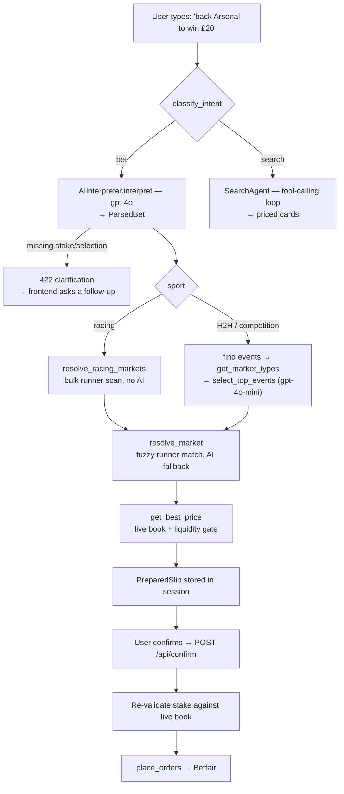

# BetAuto — a natural-language betting interface for the Betfair Exchange

[](https://github.com/stephenjjmcmahon/Bet_Automation/actions/workflows/tests.yml)
[](LICENSE)

Type **"back Constitution Hill each way at Cheltenham, £20"** and the app parses it,
finds the right race on the Betfair Exchange, matches the horse among thousands of
runners, fetches a live price, checks there's enough liquidity to fill your stake,
and hands you a confirmation slip. Confirm, and the bet goes on for real money via
the Betfair API.

The interesting part isn't the language model — it's everything between the parsed
sentence and a placeable bet. Betfair's search API **cannot find a horse by name**,
markets are named inconsistently across competitions, and "each way" means a
different market type than "to win". Most of this repo is the resolution layer that
closes that gap, and the tests that keep it honest.

There's also a conversational **search mode**: ask "what's on at Ascot today?" or
just type "Scottie Scheffler", and an agent navigates the exchange and returns
priced, one-click-bettable cards.

---

## Screenshots

<!-- TODO: capture these against a live session and drop them in docs/screenshots/.
     Three shots tell the story: the NL input box, a confirmation slip, a search result. -->

| Natural-language bet | Confirmation slip | Conversational search |
|---|---|---|
| _screenshot pending_ | _screenshot pending_ | _screenshot pending_ |

---

## Tech stack

| Layer | Choice |
|---|---|
| Backend | FastAPI + Uvicorn |
| Parsing | OpenAI `gpt-4o` (structured outputs) |
| Ranking / matching | OpenAI `gpt-4o-mini` |
| Exchange | Betfair Exchange API (`listEvents`, `listMarketCatalogue`, `listMarketBook`, `placeOrders`) |
| Frontend | Single-file vanilla JS + HTML, served by the backend at `/` |
| Storage | SQLite (bet lifecycle + analytics), JSONL (model traces) |
| Tests | pytest — 146 tests, fully mocked, no network |

---

## Architecture



The full end-to-end flow, step by step:

1. **Classify** — is this a bet instruction or a search query?
2. **Parse** — `gpt-4o` with structured outputs produces a `ParsedBet` (selection,
   sport, side, stake, market type, line, opponent, competition). Missing required
   fields return a `clarification_needed` response rather than a guess.
3. **Find events** — head-to-head sports search Betfair by text; competition sports
   (golf, racing, motor sport, politics) fetch all events, because there's no
   meaningful head-to-head name to search by.
4. **Pick event + market** — `gpt-4o-mini` ranks candidates against the available
   market types and returns up to three `{event_id, market_type}` pairs.
5. **Resolve market** — turn that into a real `marketId` + `selectionId`, with fuzzy
   runner-name matching and an AI fallback when substring matching fails.
6. **Price + liquidity check** — fetch the live book, take top-of-book for the
   requested side, and reject the slip unless the available size covers the stake.
7. **Confirm** — the stake is re-validated against a fresh book before the order is
   sent, then `placeOrders` runs and the result is checked properly (Betfair returns
   HTTP 200 for rejected bets — the real outcome is in the response body).

---

## Interesting problems solved

**Betfair cannot search for a horse.** `listEvents` `textQuery` matches event and
competition names only — never runner names. Betfair models racing as *event =
meeting*, *market = race*, *runner = horse*, so "Constitution Hill" is invisible to
every search endpoint. The resolver instead pulls **every** upcoming market of the
requested type in one bulk call (~450 on a busy day) and scans all runners for the
name. A horse runs at most once a day, so a clean match identifies the race
outright — no AI needed for the common case. Ambiguity (same greyhound name at two
tracks) returns multiple slips; too many matches asks which meeting.

**Exact matching has to beat fuzzy across two pools at once.** A horse entered only
for a future race has no win market yet, so "to win the Gold Cup" finds nothing in
the win scan and has to fall back to ante-post markets. The subtle part is
precedence: a festival usually *does* have win markets for its other races, so
scanning pools in a fixed order biases wrong in both directions — win-pool-first
hallucinates a wrong horse from today's card, ante-post-first does the reverse. The
fix is to try exact matching on both pools first, then run a **single** fuzzy pass
over the *combined* pool so the model sees every real candidate at once and picks
the globally closest.

**Trusting the model's `selection_id`, not its `market_id`.** Ante-post two-year-olds
commonly hold two or three engagements — the same horse entered in the Windsor Castle
*and* the Chesham. Asked to return a market and a selection, the model reliably
cross-wires them: market from one race, selection from another, producing a slip that
would place a bet on the wrong race. So the AI's answer is used only to recover the
runner's *name*, and the pool is then re-scanned deterministically for that name.
Market and selection can no longer disagree.

**The same trick, applied to tournaments.** A participant who appears only as a
*runner* inside a competition-level market ("England" inside "FIFA World Cup") is
invisible to a name search for exactly the same reason a horse is. The search agent
reuses the runner-scan pattern over an allowlist of outright market types, so
searching "Scottie Scheffler" surfaces his winner, top-10, and make-cut markets
alongside his fixtures.

**Two models, chosen by job.** `gpt-4o` handles parsing, where a detailed prompt and
guaranteed JSON schema matter. `gpt-4o-mini` handles ranking and fuzzy name matching,
which are cheaper, simpler, higher-volume tasks — and has far more tokens-per-minute
headroom, which matters when a broad query pulls in a full day's racing. One
consequence needed guarding: the parser applies the full market-type rules, so when
it emits a code Betfair actually offers, that code is **pinned** onto the lighter
model's picks. Without the pin, `gpt-4o-mini` kept "correcting" rugby's head-to-head
market — whose real Betfair code is the literal string `UNUSED` — to `MATCH_ODDS`,
because `UNUSED` reads like a junk value.

**Betfair's 200 doesn't mean yes.** `placeOrders` returns HTTP 200 for rejected bets;
the real status is in the `PlaceExecutionReport` body. Reporting success on the HTTP
code alone tells a user their bet is on when it isn't.

---

## Setup

**Prerequisites:** Python 3.12+, a Betfair account with an
[application key](https://developer.betfair.com), and an OpenAI API key.

```bash
git clone https://github.com/stephenjjmcmahon/Bet_Automation.git
cd Bet_Automation

python -m venv venv
source venv/bin/activate        # Windows: venv\Scripts\activate

pip install -r requirements.txt
cp .env.example .env            # then fill in your keys
```

Run it:

```bash
uvicorn backend.main:app --reload
```

The app is served at <http://localhost:8000> — sign in with your Betfair credentials
on the overlay. Run the tests with:

```bash
pytest
```

The suite is fully mocked: no network calls, no Betfair session, and no bets placed.

<details>
<summary>Docker</summary>

```bash
docker build -t betauto .
docker run --env-file .env -p 8000:8000 betauto
```
</details>

### Configuration

Every key is documented in [`.env.example`](.env.example). The ones worth knowing:

| Variable | Default | Purpose |
|---|---|---|
| `MAX_STAKE_GBP` | `100` | Hard ceiling on any single stake |
| `APP_ENV` | `development` | `production` enforces a real `SESSION_SECRET_KEY` |
| `ALLOWED_ORIGINS` | `http://localhost:8000` | CORS allowlist |
| `LOG_LEVEL` | `INFO` | `DEBUG` gives the full parse/resolve trace |
| `AI_RATE_LIMIT` | `30/minute` | Per-IP cap on the OpenAI-backed endpoints |

---

## Security notes

This is a personal project designed to run locally. Known limitations, stated
deliberately rather than overlooked:

- **The Betfair session token lives in a signed — not encrypted — cookie.**
  Starlette's `SessionMiddleware` prevents tampering, not disclosure, so the token is
  base64-readable by anyone who can read the cookie. The correct fix is server-side
  session storage with an opaque session id; that's out of scope for a
  single-process local app. See the note in `backend/services/betfair_auth.py`.
- **Stakes are capped** at `MAX_STAKE_GBP` (default £100) and re-validated against a
  live market book at confirm time, so an edited stake can't bypass the liquidity
  gate it was originally checked against.
- **Rate limits are in-memory**, so they're per-process and reset on restart. A
  multi-worker deployment would need a shared backend (Redis).
- **Credentials are never persisted.** They're posted straight to Betfair's SSO and
  only the returned token is kept, for the life of the session.
- `.env` is gitignored and has never been committed.

---

## Disclaimer

This is a personal and educational project. **It places real bets with real money on
a live betting exchange.** It is provided as-is, with no warranty; use it at your own
risk, and read the code before pointing it at an account you care about. Nothing here
is financial or betting advice, and no part of it predicts outcomes or claims an edge.

Gambling can be addictive. If it's stopping being fun, free and confidential support
is available:

- **UK** — [GamCare](https://www.gamcare.org.uk), National Gambling Helpline 0808 8020 133
- **Ireland** — [Gambling Care](https://www.gamblingcare.ie), 089 241 5401
- **International** — [Gamblers Anonymous](https://www.gamblersanonymous.org)

---

## Credits

Built by [Stephen McMahon](https://github.com/stephenjjmcmahon).

Early work on this project was done together with **James McNamee**
([jamesmcnamee8255](https://gitlab.com/jamesmcnamee8255)), who contributed the
original frontend, the first version of the bet-slip construction, and a good part
of the AI interpreter's prompt design — much of which is still in the codebase today.

Market data and bet placement via the
[Betfair Exchange API](https://betfair-developer-docs.atlassian.net/wiki/spaces/1smk3cen4v3lu3yomq5qye0ni/overview).
A full reference of the market types this app handles is in
[`docs/Market_Types.md`](docs/Market_Types.md).
